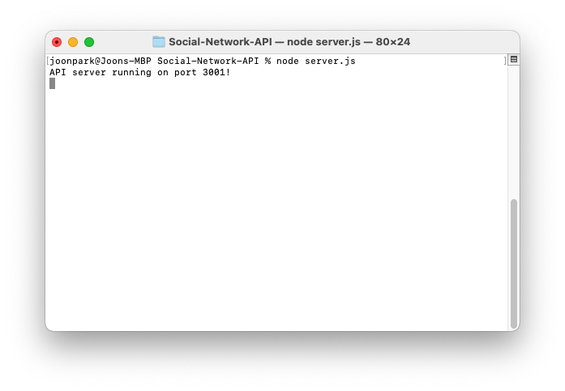
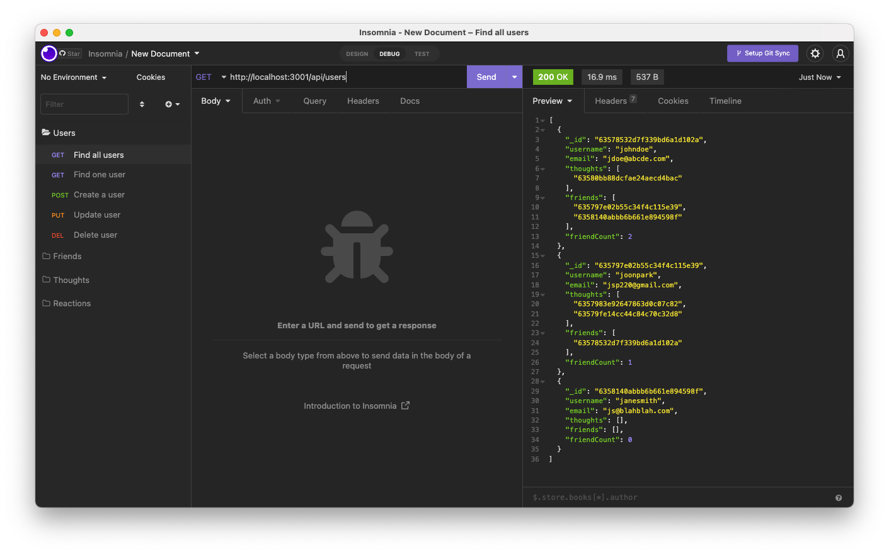
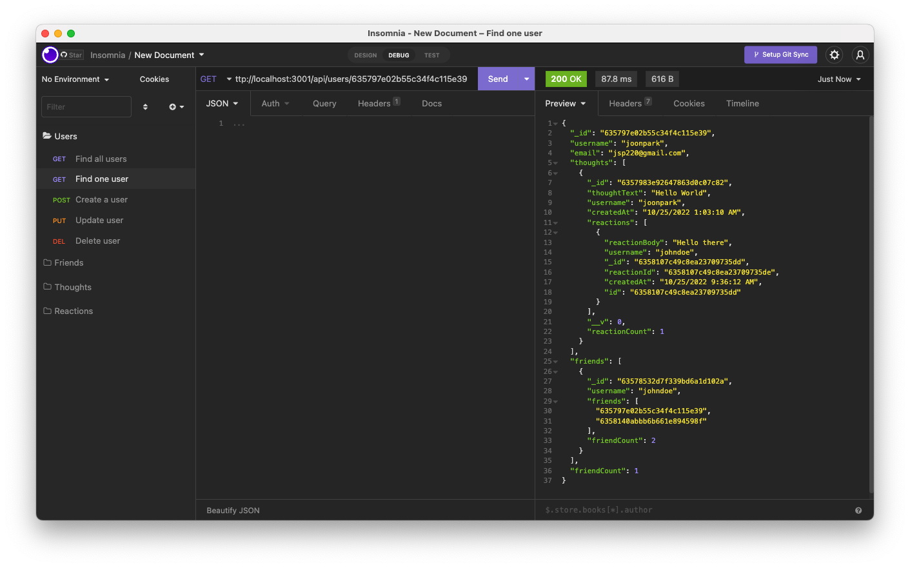
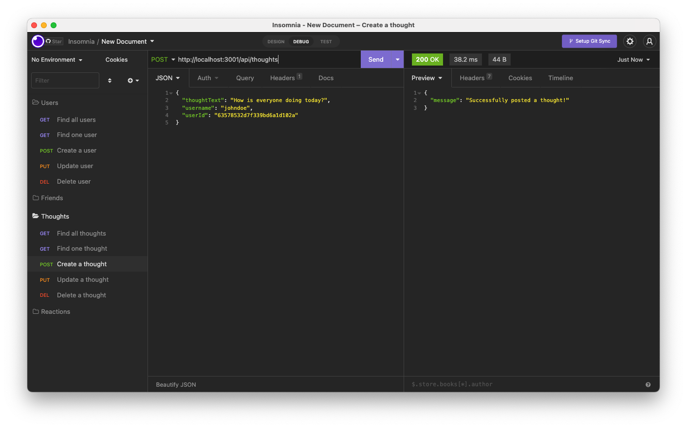
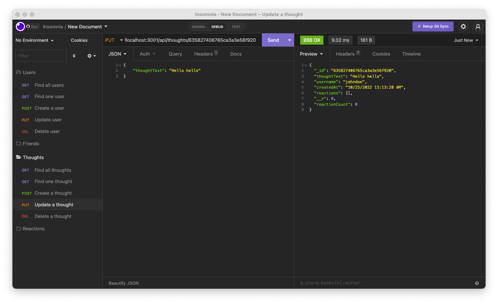
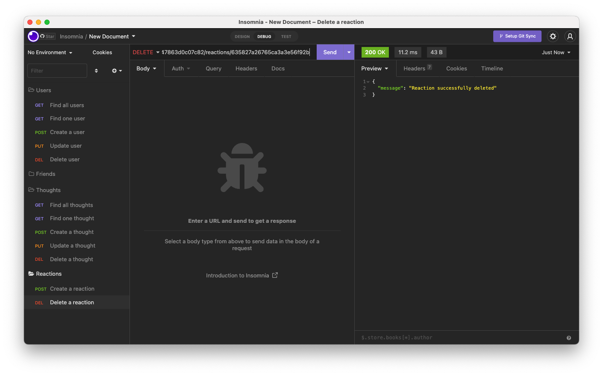

# Social-Network-API

## Description

[](https://opensource.org/licenses/MIT)

A back end API of a social network application that allows users to share thoughts and reactions to those thoughts.

## Usage

Clone this repo into a local folder. Enter the following node command to install the necessary dependencies:

```Shell
npm install
```

Then, enter the following command to run the application:

```Shell
node server.js
```



Using an API client such as Insomnia, you are able to create, read, update, and delete (CRUD) users, thoughts, and reactions (no update).







## Walkthrough Video

[Walkthrough Video]()

## License

Licensed under the MIT license.